# KOELECTRA를 활용한 병원 원격진료 앱 리뷰 감성 분석

## 1. 개요

### 1.1 문제정의

최근 여려 병원들은 전문의 부족으로 인해 소아청소년 응급실 야간 진료를 중단하거나 진료 시간을 감축하는 등의 조치를 취하고있다.
이로 인해 한정적인 진료 시간대에 많은 사람들이 모여들게 되었고, 이는 곧 긴 대기 시간으로 이어지게 되었다. 소아과 오픈런은 물론이며 
4-5시간 대기 후에 진료를 받는 일도 일상이 되었다.
이러한 상황 속 똑닥은 모바일 진료 예약 기능을 통해 순식간에 부모들의 육아 필수 앱이 되었다.[[1]](https://www.medicaltimes.com/Main/News/NewsView.html?ID=1112939)  
똑닥은 무료 진료 예약 서비스로 큰 인기를 끌었으며, 여러 병원 또한 똑닥과 제휴를 맺을 정도로 크게 성장해나갔다.

<div> 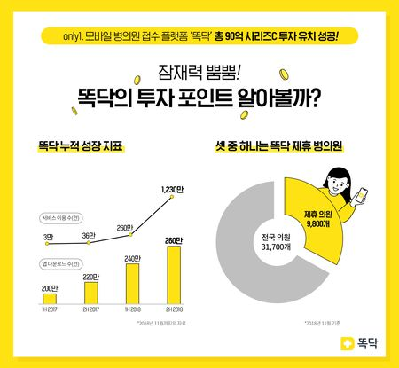 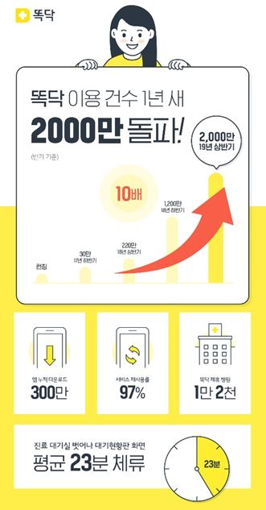 </div>


하지만 유료 서비스로 전환된 뒤, 앱에 대한 평가는 월 1000원으로 이정도 서비스면 결제할 의향이 있다는 
긍정적인 의견, 공립이 아닌 사기업을 통한 병원 예약은 의료 민영화로 이어질 수 있다. 또는 진료 예약에도 돈을 내야하는 것에 불만이 있는 부정적인 의견으로 나뉘게 되었다.[[2]](https://www.ibabynews.com/news/articleView.html?idxno=112206)
이 프로젝트에서는 앱 리뷰 데이터를 통해 긍,부정을 판별하는 인공지능 모델을 만들고, 학습을 통해 판별된 데이터로 사용자의 리뷰를 분석해 이를 기반으로 서비스 개선 방안을 제시할 수 있는 프로그램램을 만들고자한다.

### 1.2 데이터 및 모델 개요

데이터는 구글 플레이 앱스토어에서 제공하는 똑닥 리뷰를 크롤링한 약 1만 2천건의 데이터를 활용해 사전 학습 모델의 재학습을 진행하고자 한다.

| 입력 | 모델 |출력|
|----------|---|---|
| 똑닥 리뷰 문장 | KoELECTRA-Small-v3 <sup>[[3]](https://huggingface.co/monologg/koelectra-small-discriminator)</sup> |부정(0), 긍정(1)|

똑닥 리뷰 데이터셋의 수집 기간은 2015년 2월부터 2024년 11월이며, 구글 플레이 스토어에 있는 리뷰를 수집하여 만들었다.
학습을 진행할 모델은 KOELECTRA로 최고 수준의 한국어 자연어 처리 모델 중 하나이다. 이 프로젝트에서는 koelectra-small-v3 모델을 활용하였다.

## 2. 데이터

### 2.1 탐색적 데이터 분석

| |score| content |date|
|-|----------|---|--|
|0|5|굿| 2024-11-18 |
|1|1|시간 예약 안 됨...그럴꺼면 유료어플 하지마라 아니면 시간예약을 받던지 개선 필요| 2024-11-18 |
|2|5|좋음| 2024-11-15 |
|3|4|편리해요| 2024-11-14 |
|..|...|...|...| .. |
|12254|5|깔끔해서 쉽게 찾을 수 있고 카톡 페이스북계정이라 쉽게 이용할 수 있어서 좋아요~~| 2015-02-02 |
|12255|5|페북 보구 깔아봤는데 겁나 유용하네요ㅇㅇ 대학생이면 특히 추천쌔림ㅇㅇ| 2015-02-02 |
|12256|5|실질적인 혜택들이 많네요... 굿~~!| 2015-02-02 |

12257건의 데이터로 이루어져있으며 score, content, date 열로 구성되어있다. 

<div><p align='center'>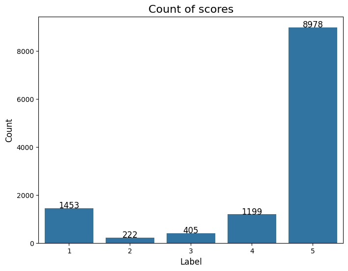</p></div>

score열은 1-5점의 평점으로 이루어져있으며, 최고점인 5점이 약 10000건 최저점인 1점이 약 1400건으로 구성되어있다.

### 2.2 데이터 전처리

제일 먼저 데이터의 결측치를 확인해본 결과, 데이터의 결측치는 없는 것으로 나타났다.

```
print('결측치 = ', data.isnull().values.sum())
data = data.dropna(how = 'any')
print('데이터 개수', len(data)
```

```
결측치 =  0
데이터 개수 12257
```

데이터 전처리를 진행하며 데이터셋이 크지 않아 결측치를 제외한 추가적인 규정사항을 두지않았다.
데이터셋에 라벨이 존재하지않아 score열을 이용해 4-5는 긍정(1) 1-2는 부정(0)으로 두어 라벨링을 진행하였으며 보다 정확한 학습을 위해 3점의 score를 가진 데이터는 제외하였다.

- 최종데이터 셋.

| | score | content | date | label |
|-|----------|---|--|--|
|0|1|Galaxy 24 Ultra 와 galaxy 24 Plus 집에 세대 있는데 다 8월 이후 똑딱 QR코드 처방전 등록이 안됨. 잘 되다가 갑자기 안 되는 이유를 모르겠고 빨리 수정 바람. 삭제하고 다시 깔아도 안됨| 2024-11-24 | 0 |
|1|5|시간절약| 2024-11-23 | 1 |
|2|1|똑딱 대기번호와 실제 대기번호가 다릅니다. 병원에서는 똑딱시스템에 대해 잘 모르던데 병원과 연계가 부족한듯합니다.| 2024-11-22 | 0 |
|3|1|사용 불편| 2024-11-19 | 0 |
|..|...|...|...| .. | .. |
|12254|5|깔끔해서 쉽게 찾을 수 있고 카톡 페이스북계정이라 쉽게 이용할 수 있어서 좋아요~~| 2015-02-02 | 1 |
|12255|5|페북 보구 깔아봤는데 겁나 유용하네요ㅇㅇ 대학생이면 특히 추천쌔림ㅇㅇ| 2015-02-02 | 1 |
|12256|5|실질적인 혜택들이 많네요... 굿~~!| 2015-02-02 | 1 |

- 데이터 전처리 후 긍 부정 비율.

<div><p align='center'>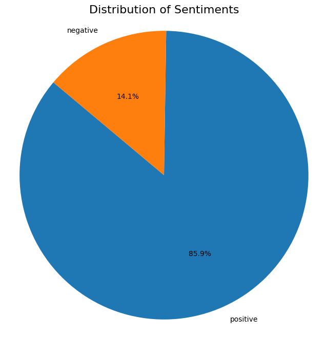</p></div>

데이터 전처리 후 긍 부정비율이다. 총 데이터셋에서 긍정이 약 86% 부정이 약 14% 인것으로 나타났다.

- 랜덤 학습데이터 추출

모델의 학습을 위해 랜덤으로 데이터를 추출해 샘플 데이터셋을 만들었다.
보다 더 유의미한 프로젝트를 위해 score열만을 이용한 라벨링 데이터셋과 score를 기준으로 라벨링 한 뒤 직접 다시 라벨링을 진행한 데이터셋을 준비하였으며
두개의 샘플 데이터 모두 전체 데이터셋의 긍 부정 비율을 고려해 1:3 비율로 추출을 진행하였다.

- score를 이용한 학습데이터

| | score | content | date | label |
|-|----------|---|--|--|
|0|5|우리아기 병원예약 늘 똑딱으로 해서 다니고있어요. 편리합니다^^| 2021-10-12	| 1 |
|1|5|너무 편리하고 좋아요!| 2019-12-28 | 1 |
|..|...|...|...| .. | .. |
|1998|1|처음가는 병원 똑딱으로 접수해도 주민번호 다시 불러야되던데 그럼 굳이 똑딱에는 주민뒷번호 까지 왜 수집함? 니들이 뭔데? 남의정보 수집함??| 2015-02-02 | 0 |
|1999|1|쓰지마삼 약국 1도 안뜸ㅋㅋ| 2015-02-02 | 0 |

- 직접 라벨링을 거친 학습데이터

| | score | content | date | label |
|-|----------|---|--|--|
|0|5|병원 검색할때 찾기 쉽고 똑딱쓰는 병원은 예약하기 편하고 좋아요. 여러 병원이 이용했음 좋겠어요| 2022-11-07	| 1 |
|1|5|바라던 앱에다 이름까지 귀엽고!이 앱 만들어주셔서 감사해요♡| 2016-06-16 | 1 |
|..|...|...|...| .. | .. |
|1298|1|병원 예약을 돈내고 앱을 통해 하게 만들고 돈 없거나 앱 쓸줄 모르는 사람들은 의료혜택 차별받게 하는 양아치 앱. 사용하지 않아야 합니다. 앱 기획의도 자체가 쓰레기 같네요. 먼저 간 사람이 먼저 검진하는게 당연합니다. 앱 삭제 하세요| 2023-12-05 | 0 |
|1299|1|	처음 설치해봤는데 환자명에 다른 사람이름이 있었어요. 제 정보로 수정했는데 계속해서 그 분 정보로 바뀌더라구요. 카카오연동후에 그러는거 같은데 오류인가요? 좀 무섭네요.| 2020-02-04 | 0 |

- 학습데이터.
랜덤 추출(스코어 활용) 정확도 0.93
직접 추출 정확도 0.99

## 3. 재학습 결과
### 3.1 개발환경
      

## 3.2 KOELECTRA fine-tuning

KOELECTRA 모델을 fine-tunning하며 각각 2000건, 1300건의 데이터를 학습 데이터를 사용했으며, 데이터를 학습시킨 뒤 총 12257건의 데이터에 적용시켜 모델을 테스트했다.
랜덤 추출 학습데이터 2가지 학습률 추이, 각 모델의 정확도 비교분석.

## 4. 모델 적용 데이터 활용.

위 단계에선 앞서 학습한 데이터를 토대로 사용자 경험을 기반으로한 서비스 개선 방안을 제안하는 과정을 보여주고자 한다.

이 단계에선 두 개의 모델중 정확도가 더 높았던 2번째 모델이 예측한 데이터셋을 활용할 것이다.

### 4.1 데이터 분석

데이터를 연,월별로 분석한 뒤 확실한 결과를 얻기 위해 큰 변화폭을 가진 데이터에 집중해 분석을 진행할 것이다.

#### 연별 리뷰

<div><p align='center'>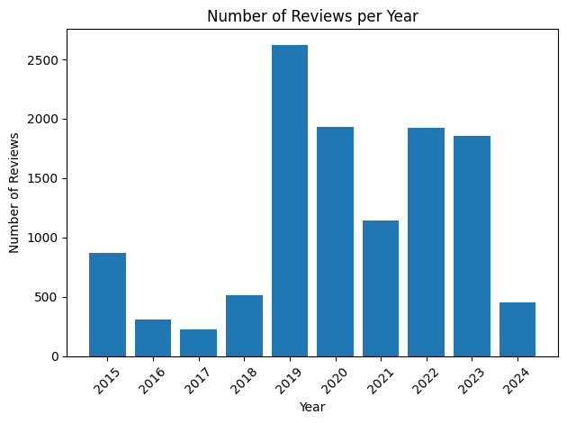</p></div>

데이터를 수집한 2015년 부터 2024년까지의 리뷰수 분포 그래프이다.

그래프에 보이다시피 코로나가 발발한 2019년도의 리뷰수가 압도적으로 많고, 그 뒤로 2020, 2022, 2023년이 뒤따라 오는것을 알 수 있다.

<div><p align='center'>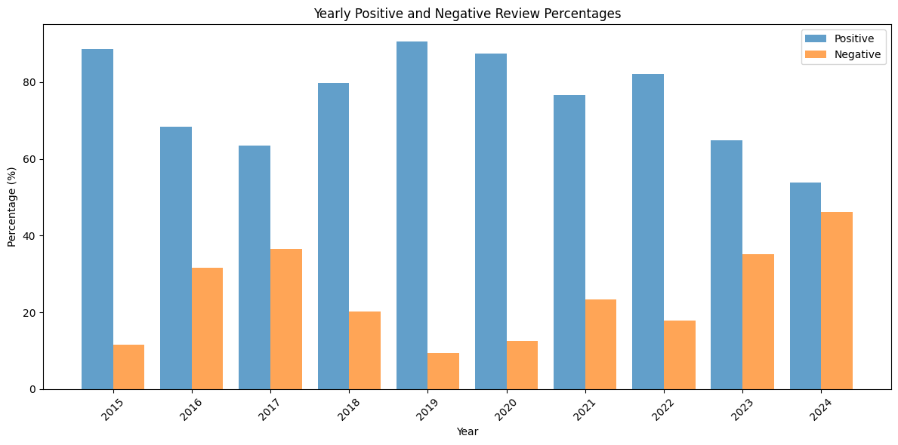</p></div>

연별 리뷰의 긍부정 분포 그래프이다.

2015, 2019, 2020년의 리뷰는 긍정이 많은 반면 2017,2023, 2024년의 리뷰는 부정 비율이 많은 것을 알 수 있다.

#### 월별 리뷰

앞서 말했듯, 큰 변화폭을 가진 2017, 2019, 2024년도의 데이터에 대해 집중적으로 분석할 것이다.

- 2017
  
<div><p align='center'>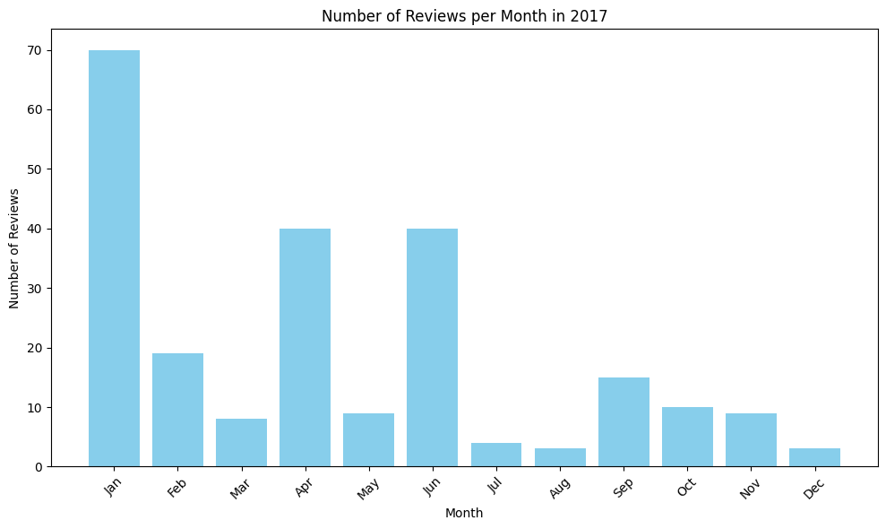</p></div>
<div><p align='center'>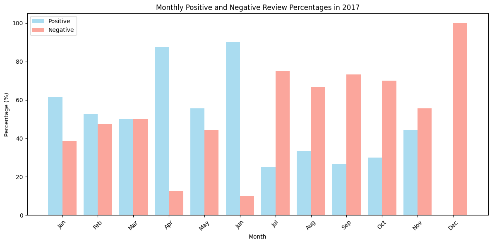</p></div>

2017년의 리뷰 수는 1월에 집중되어있으며, 긍부정 비율은 2, 3월과 7월 이후에 긍정과 부정의 비율이 비슷하거나 부정의 비율이 더 많아진 것을 알 수 있다.

- 2019

<div><p align='center'>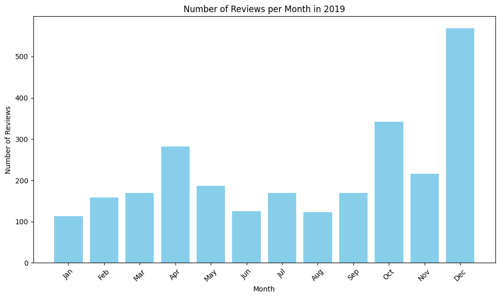</p></div>
<div><p align='center'>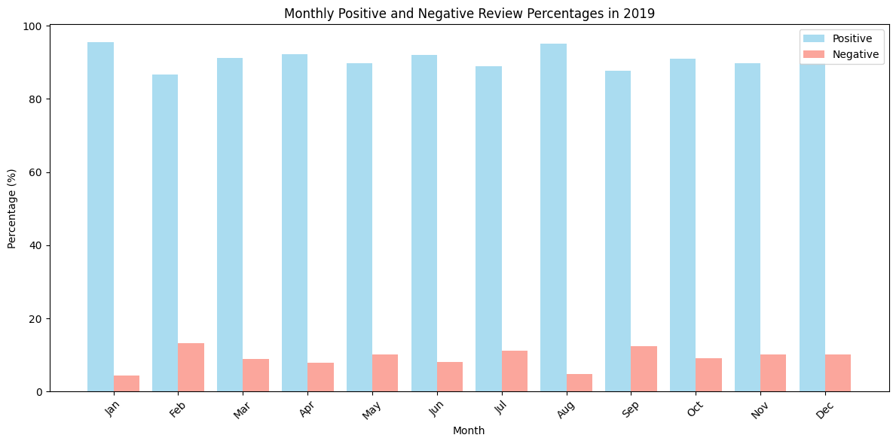</p></div>

2019년 그래프의 리뷰수는 12월달에 집중되어있으며, 모든 월이 긍정의 비율이 압도적으로 많았다.
이는 코로나 펜데믹 시절 똑닥의 서비스에 사용자 대부분의 만족도가 높았음을 시사한다.

- 2024

<div><p align='center'>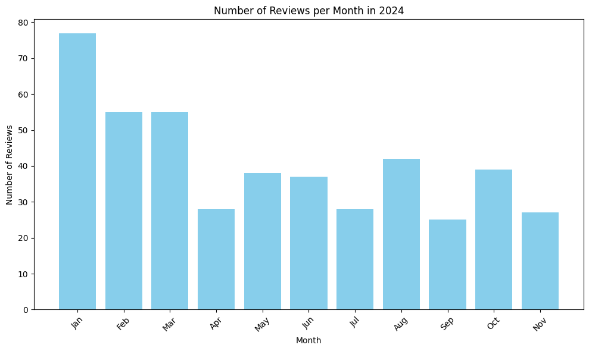</p></div>
<div><p align='center'>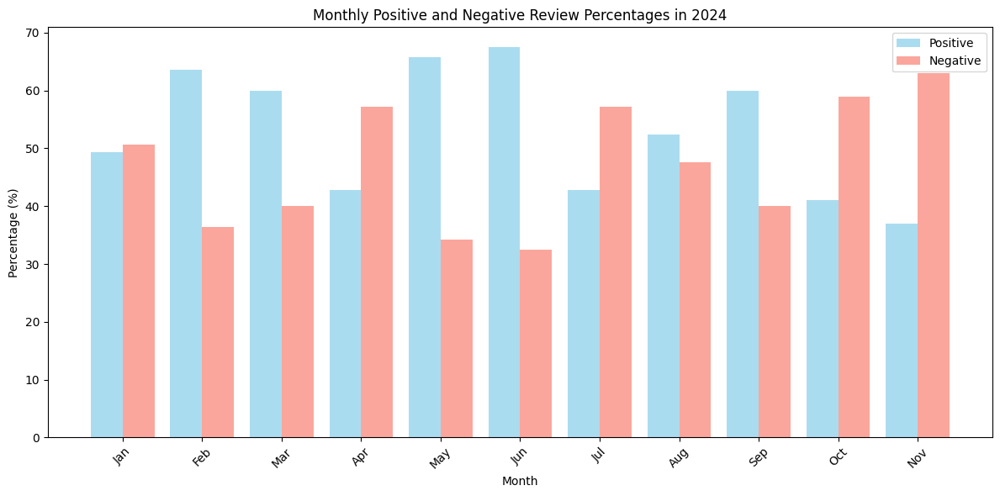</p></div>

2024년의 리뷰 수 또한 1월에 집중되어있으며 2, 3, 5, 6, 9월달을 제외하면 부정의 비율이 긍정과 비슷하거나 더 많은 것을 알 수 있다.

### 4.3 사용자 유입/이탈 분석

위 그래프의 긍부정 결과를 토대로 사용자가 어플의 어떤 점을 좋게 또는 나쁘게 보았는지를 토픽모델링을 통해 알아낸 뒤 이를 토대로 사용자 유입/이탈을 연결하고자 한다.

https://engine.roa.ai/companies/gEQGSsi0/financial_statements 기업 재무재표 참고

- 2017
(부정 토픽)
- 2019
(긍정 토픽)
- 2024
(부정 토픽)
### 4.4 기대 효과

## 5. 결론 및 느낀점


