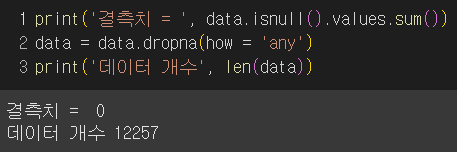

# KOELECTRA를 활용한 병원 원격진료 앱 리뷰 감성 분석

## 1. 개요

### 1.1 문제정의

최근 여려 병원들은 전문의의 부족으로 인해 소아청소년 응급실 야간 진료를 중단하거나 진료 시간을 감축하는 등의 조치를 취하고있다.
이로 인해 한정적인 진료 시간대에 많은 사람들이 모여들게 되었고, 이는 곧 긴 대기 시간으로 이어지게 되었다. 소아과 오픈런은 물론이며 
4-5시간 대기 후에 진료를 받는 일도 일상이 되었다.
이러한 상황 속 똑닥은 모바일 진료 예약 기능을 통해 순식간에 부모들의 육아 필수 앱이 되었다.[[1]](https://www.medicaltimes.com/Main/News/NewsView.html?ID=1112939)  
똑닥은 무료 진료 예약 서비스로 큰 인기를 끌었으며, 여러 병원 또한 똑닥과 제휴를 맺을 정도로 크게 성장해나갔다.

   

하지만 유료 서비스로 전환된 뒤, 앱에 대한 평가는 월 1000원으로 이정도 서비스면 결제할 의향이 있다는 
긍정적인 의견, 공립이 아닌 사기업을 통한 병원 예약은 의료 민영화로 이어질 수 있다. 또는 진료 예약에도 돈을 내야하는 것에 불만이 있는 부정적인 의견으로 나뉘게 되었다.[[2]](https://www.ibabynews.com/news/articleView.html?idxno=112206)
이 프로젝트에서는 앱 리뷰 데이터를 통해 긍,부정 비율과 각각의 대표 의견을 알아내 어느 부분에서 앱의 긍부정을 판단하는지를 알아보는 인공지능 모델을 만들고, 이를 통해 앱의 전반적 어쩌구.....할거임..ㅇㅇ

### 1.2 데이터 및 모델 개요

데이터는 구글 플레이 앱스토어에서 제공하는 똑닥 리뷰를 크롤링한 약 1만 2천건의 데이터를 활용해 사전 학습 모델의 재학습을 진행하고자 한다.

| 입력 | 모델 |출력|
|----------|---|---|
| 똑닥 리뷰 문장 | KoELECTRA-Small-v3 [[3]](https://huggingface.co/monologg/koelectra-small-discriminator) |부정(0), 긍정(1)|

똑닥 리뷰 데이터셋의 수집 기간은 2015년 2월부터 2024년 11월이며, 구글 플레이 스토어에 있는 리뷰를 수집하여 만들었다.
학습을 진행할 모델은 KOELECTRA로 최고 수준의 한국어 자연어 처리 모델 중 하나이다. 이 프로젝트에서는 koelectra-small-v3 모델을 활용하였다.

## 2. 데이터

### 2.1 탐색적 데이터 분석

| |score| content |date|
|-|----------|---|--|
|0|5|굿| 2024-11-18 |
|1|1|시간 예약 안 됨...그럴꺼면 유료어플 하지마라 아니면 시간예약을 받던지 개선 필요| 2024-11-18 |
|2|5|좋음| 2024-11-15 |
|3|4|편리해요| 2024-11-14 |
|..|...|...|...| .. |
|12254|5|깔끔해서 쉽게 찾을 수 있고 카톡 페이스북계정이라 쉽게 이용할 수 있어서 좋아요~~| 2015-02-02 |
|12255|5|페북 보구 깔아봤는데 겁나 유용하네요ㅇㅇ 대학생이면 특히 추천쌔림ㅇㅇ| 2015-02-02 |
|12256|5|실질적인 혜택들이 많네요... 굿~~!| 2015-02-02 |

12257건의 데이터로 이루어져있으며 score, content, date 열로 구성되어있다. 

score열은 1-5점의 평점으로 이루어져있으며, 최고점인 5점이 약 9000건 최저점인 1점이 약 1400건을 차지하고있다.
1-5까지의 각열은 어쩌구 저쩌구의 수로 이루어져있고 1-2점을 부정, 4-5점을 긍정으로 간주했을 때 긍부정의 비율이 약 1:6의 비율로 이루어져있다.

### 2.2 데이터 전처리

제일 먼저 데이터의 결측치를 확인해본 결과, 데이터의 결측치는 없는 것으로 나타났다......

데이터 전처리를 진행하며 데이터셋이 크지 않아 결측치를 제외한 추가적인 규정사항을 두지않았다.

데이터셋에 라벨이 존재하지않아 score열을 이용해 4-5는 긍정(1) 1-2는 부정(0)으로 두어 라벨링을 진행하였으며 보다 정확한 학습을 위해
3점의 score를 가진 데이터는 제외하였다.

최종데이터 셋.
이미지. 똬.

데이터 전처리 후 긍 부정 비율.
이미지. 똬.

랜덤 학습데이터 추출, 
모델의 학습을 위해 

직접 학습데이터 추출 2가지 비교(더 확실한 학습을 위해 1,2 또는 4,5인 경우 리뷰 중간에 모호한 단어 또는 평가가 있을 시, 그 데이터 제외 -> 확실한 긍,부정을 나타내는 데이터만 이용).

두개의 학습데이터.
랜덤 추출(스코어 활용) 정확도 0.93
직접 추출 정확도 0.99

## 3. 재학습 결과

개발환경, koelectra를 이용해 몇개의 데이터 학습햇는지, 학습 그래프 그리고... 모델적용.

## 4. 모델 적용 데이터 활용?

-스토리라인 구성
랜덤 추출 학습데이터 2가지 학습률 추이, 각 모델의 정확도 비교분석.
각 모델을 전체 데이터에 적용시킨뒤 모델이 label을 붙인 데이터를 토대로
다시금 데이터 분석
년별, 분기별, 월별 예정.
이때는 큰 변화폭을 가진 데이터들만을 이용해 데이터분석 예정.
각 리뷰수가 증/감 -> 사용자 이탈률 비교분석
각 년/분기/월별 긍부정 분석 -> 사용자 이탈률..비교분석..?
매출은 2023.9월 이후 발생했으니 매출 감소와 리뷰수 연결 함 해보고..

그럼 어짜피 부정비율이 확 높아지는것? -> 2023년 8월달부터 즉 유료전환 선언이후
요걸로 이으면서 토픽으로 연결 ㄱㄱ

이후 결론을 어케짓지.

## 5. 결론 및 느낀점

결론... 
koelectra를 활용한 모델 감성분석을 통해 각 리뷰의 긍부정, 리뷰수를 통해 사용자의 추이와 뮤ㅗ,,,뭐...잇자나......쨋든
그걸 예측할수있엇으며 실제 데이터와 비교햇을때 실제 연결되는 부분이 유의미하게 존재했 어쩌구...(이건 데이터분석후 다시 작성)
즉 모델 생성에 그치지않고 모델이 판단한 데이터를 통해 이러한 과업도 충분히 가능할지도~ 요런느낌 ㅇㅇ..

